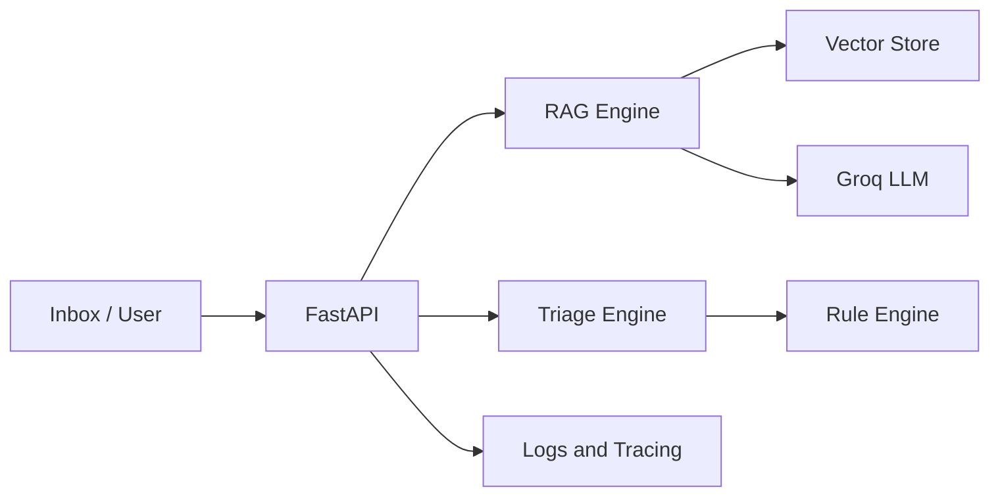

# OpsVault AI

OpsVault AI is a small "knowledge + action" assistant:
1. Answers questions from internal docs with citations (RAG)
2. Triages inbound messages and drafts grounded replies

## Who it's for

Small teams (ops/support/sales) that waste time searching PDFs/FAQs and replying to repetitive emails.

## Features (Roadmap)

- 0: API scaffold + sample data
- 1: Docker + AWS deploy (ECS Fargate)
- 2: RAG with citations + eval harness
- 3: LangGraph action agent + safe tools
- 4: CI/CD + monitoring + guardrails

## Architecture



## Run the API (local)

```bash
pip install -r backend/requirements.txt
uvicorn backend.app.main:app --reload --port 8000
```

## Build the doc index (for retrieval)

```bash
python -m backend.app.rag.ingest --docs data/kb --out data/index.jsonl
```

## Quick Demo (2 minutes)

### 1) Build the doc index

```bash
python -m backend.app.rag.ingest --docs data/kb --out data/index.jsonl
```

### 2) Start the server

```bash
uvicorn backend.app.main:app --reload --port 8000
```

Open [http://localhost:8000](http://localhost:8000) — the UI has **Ask** and **Triage** tabs.
API docs at [http://localhost:8000/docs](http://localhost:8000/docs).
